# PyCity Schools with Pandas

## Overview of the school district analysis:

The School board is suspecting that math and reading grades for Thomas High School have been altered for the 9th grade and they would like to know how those grades are affecting the overall school district analysis. 

## Results: 

1.District summary:

Results including Thomas High School 9th Grades in Maths and reading:
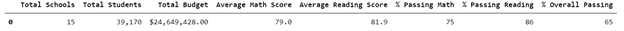 

Results excluding Thomas High School 9th Grades in Maths and reading: 
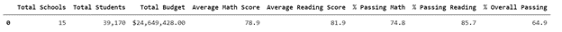 

## Summary:

The Thomas High School 9th grade in reading and math have very little to no impact on the school district analysis. So we can see that school district analysis is overall not affected.  

### 2.School summary:

Summary: As the changes have been made only in Thomas high school grades, the rest of the schools results have not been impacted, as you can see below :

Results including Thomas High School 9th Grades in Maths and reading (showing only a sample from the top on the list, the same rule applies for the rest of the list):
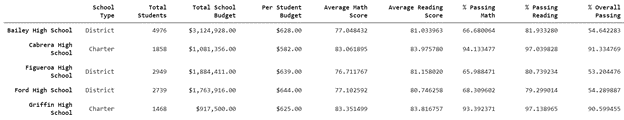  

Results excluding Thomas High School 9th Grades in Maths and reading (showing only a sample from the top on the list, the same rule applies for the rest of the list):
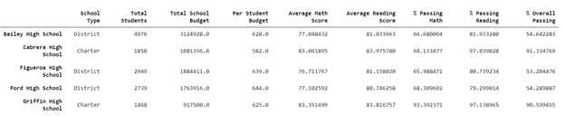  

### 3.Thomas High School Performance compared to the rest of the schools:

Thomas High School performance including the ninth graders’ math and reading scores:
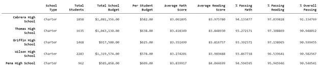 
  
Thomas High School performance excluding the ninth graders’ math and reading scores:

Summary:
Thomas High School performance was not affected compared to the rest of the schools. It still ranks second in terms of the overall passing scores.
The ninth grades’ reading and math scores had a verry little impact on the overall score for Thomas High School:
* The average math score went from 83.418% to 83.350% and the % passing in math went from 93.272% to 93.185%
* The average reading score went from 83.848% to 83.896% and the % passing in reading went from 97.308% to 97.018%
* The overall passing score went from 90.948% to 90.630%.

### 4.Replacing the ninth grades scores effect:

4.1 Math and reading scores by grade:

Summary: No noticeable effect on the scores by grade:
*Including Thomas High school data:
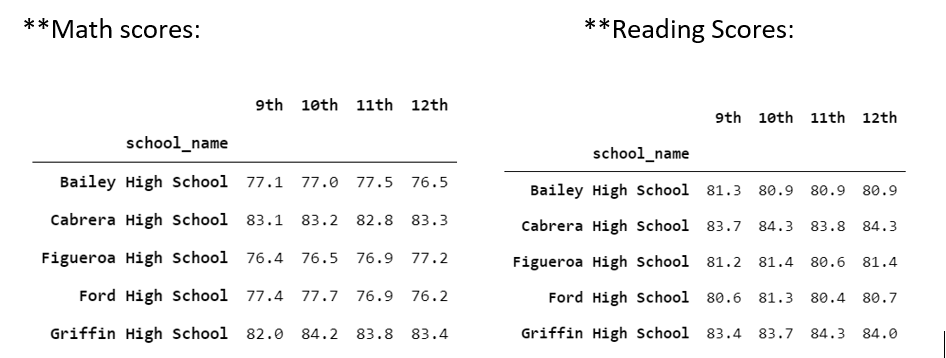 
*Excluding Thomas High school data:
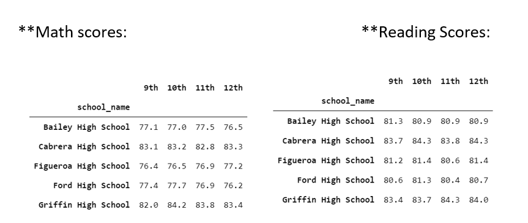 

4.2 Scores by school spending:

Summary: No noticeable effect on the scores by school spending:
*Including Thomas High school data:
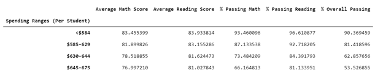  
*Excluding Thomas High school data:
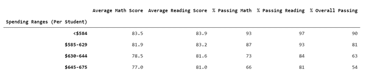  

4.3 Scores by school size

Summary: No noticeable effect on the scores by school spending:
*Including Thomas High school data:
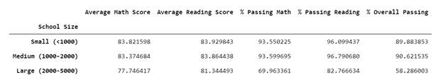 

*Excluding Thomas High school data:
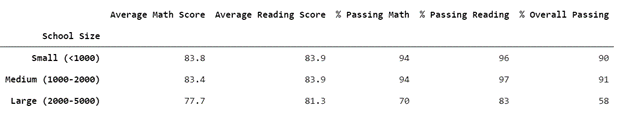 

4.4 Scores by school type

Summary: No noticeable effect on the scores by school spending:
*Including Thomas High school data:
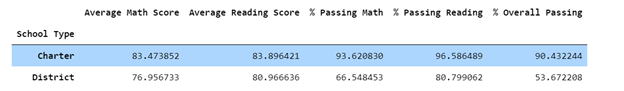  
*Excluding Thomas High school data:
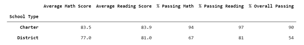  

